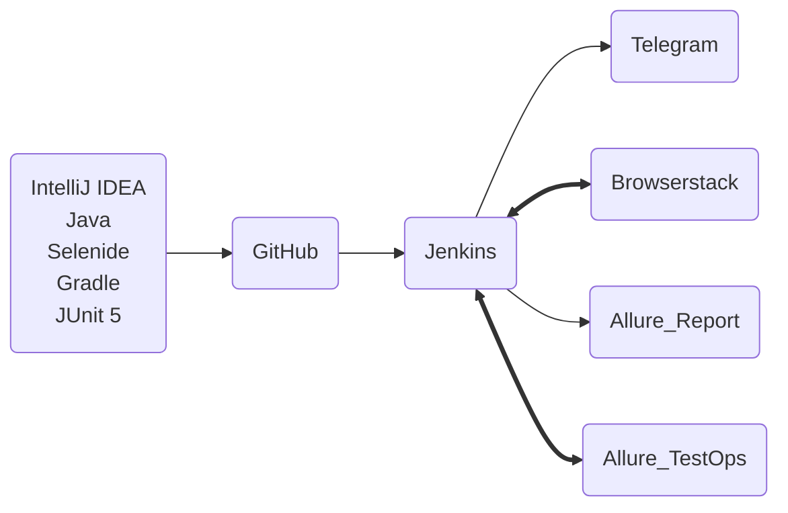
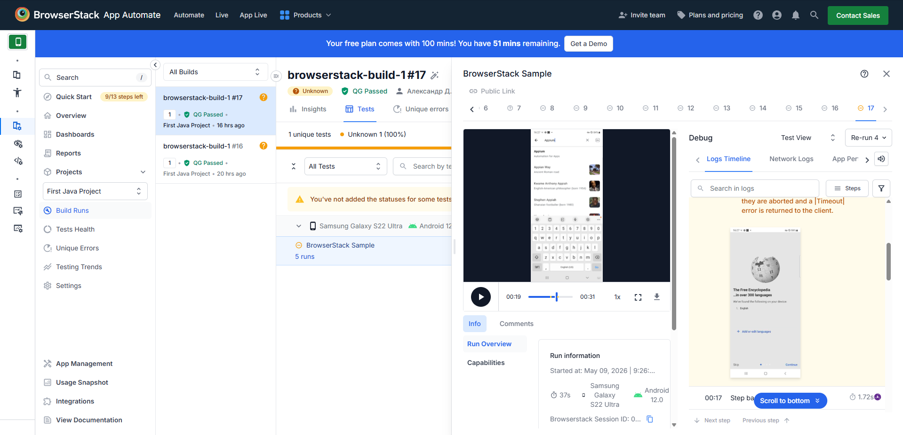
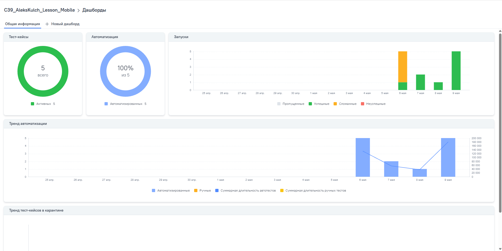
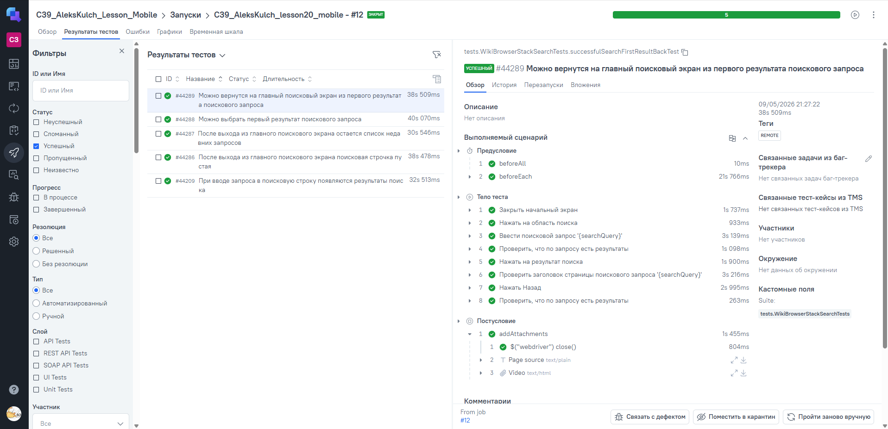
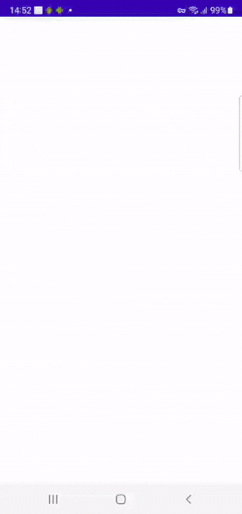

# Проект по автоматизации тестирования мобильного приложения [Wikipedia](https://www.wikipedia.org/)

<p align="center">
  
</p>

## :card_index_dividers: Содержание:

- [Использованный стек технологий и инструментов](#tech-stack)
- [Запуск автотестов](#arrow_forward-запуск-автотестов)
- [Сборка в Jenkins](#-сборка-в-jenkins)
- [Allure Report](#-allure-report)
- [Интеграция с Allure TestOps](#-интеграция-с-allure-testops)
- [Уведомления в Telegram](#-уведомления-в-telegram)  
- [Видеопример выполнения теста на сервисе Browserstack](#-видеопример-выполнения-теста-на-сервисе-browserstack)

## <span id="tech-stack"> :computer: Использованный стек технологий и инструментов

<p align="center">
  <a href="https://www.jetbrains.com/idea/" target="_blank">
    
  </a>
  <a href="https://github.com" target="_blank">
    
  </a>
  <a href="https://www.java.com" target="_blank">
    
  </a>
  <a href="https://selenide.org" target="_blank">
    
  </a>
  <a href="https://gradle.org" target="_blank">
    
  </a>
  <a href="https://junit.org/junit5/" target="_blank">
    
  </a>
  <a href="https://developer.android.com" target="_blank">
    
  </a>
  <a href="https://developer.android.com/studio" target="_blank">
    
  </a>
  <a href="https://appium.io" target="_blank">
    
  </a>
  <a href="https://appium.io/docs/en/latest/quickstart/install/" target="_blank">
    
  </a>
  <a href="https://www.browserstack.com" target="_blank">
    
  </a>
  <a href="https://jenkins.io" target="_blank">
    
  </a>
  <a href="https://allurereport.org/" target="_blank">
    
  </a>
  <a href="https://telegram.org" target="_blank">
    
  </a>
  <a href="https://qameta.io/allure-testops/" target="_blank">
    
  </a>
</p>

- В данном проекте реализованны мобильные автотесты на UI.
- Автотесты написаны на языке <code>Java</code> с использованием фреймворка для автоматизации тестирования веб‑приложений [Selenide](https://selenide.org/).
- В качестве сборщика был использован - <code>Gradle</code>.
- В качестве фреймворка модульного тестирования задействован <code>JUnit 5</code>.
- `Page Object` шаблон проектирования.
- Использована технология `Owner` для придания тестам гибкости и легкости конфигурации.
- Локальный запуск тестов на компьютере использует технологии Android Studio, Appium Server и Appium ([инструкция](https://autotest.how/appium-setup-for-local-android-tutorial-md))
- Удаленный запуск тестов происходит на стороннем сервисе  [Browserstack](https://app-automate.browserstack.com/dashboard/v2/quick-start/setup-browserstack-sdk).
- Для удаленного запуска реализована джоба в **Jenkins** с формированием Allure-отчета и отправкой результатов в **Telegram** при помощи бота.
- Осуществлена интеграция с **Allure TestOps**
- Реализована возможность запуска тестов непосредственно из **Allure TestOps** — как полного прогона, так и выборочного выполнения отдельных тест‑кейсов или групп тестов.

### Реализована следующая схема взаимодействия технологий и инструментов


## :arrow_forward: Запуск автотестов

### Локальный запуск тестов из терминала

Запуск локально (local) на эмуляторе:
```bash 
 ./gradle clean local_test -DdeviceHost=local
```
> Для запуска локальных тестов на компьютере должны быть установлены Android Studio, Appium Server и Appium ([инструкция](https://autotest.how/appium-setup-for-local-android-tutorial-md))

Запуск удаленно (remote) на Browserstack:
```bash 
 ./gradle clean remote_test -DdeviceHost=remote
```
### Удалённый запуск осуществляется через Jenkins

Удаленный запуск происходит на стороннем сервисе Browserstack.
При необходимости также можно переопределить параметры запуска

```bash
clean
remote_test
-DdeviceHost=${HOST}
-Dbrowserstack.user=${USER}
-Dbrowserstack.key=${KEY}
-Dapp=${APP}
-Ddevice=${DEVICE}
-Dos_version=${OS}
-DbaseUrl=${BASE_URL}
```

### Параметры сборки

- <code>HOST</code> – браузер, в котором будут выполняться тесты.
- <code>USER</code> – логин (имя пользователя) для аутентификации в сервисе BrowserStack.
- <code>KEY</code> – секретный ключ (API‑ключ) для аутентификации.
- <code>APP</code> – идентификатор приложения установленного на стороннем сервисе  [Browserstack].
- <code>DEVICE</code> — модель устройства, на котором будет выполняться тест.
- <code>OS</code>— версия операционной системы на целевом устройстве.
- <code>BASE_URL</code> – базовый Url выполнения теста для сайта browserstack.com.

##  Сборка в [Jenkins](https://jenkins.autotests.cloud/job/C39_AleksKulch_lesson20_mobile/)
### Главная страница
<p align="center">

</p>

### Страница запуска с возможностью изменить параметры
<p align="center">

</p>

###  Страница отслеживания удаленного запуска в [Browserstack](https://app-automate.browserstack.com/projects/First+Java+Project/builds/browserstack-build/18?tab=tests&testListView=spec&details=3354945659)

<p align="center">

</p>

##  Allure [Report](https://jenkins.autotests.cloud/job/C39_AleksKulch_lesson20_mobile/12/allure/)

Содержание Allure-отчета:

- Шаги теста;
- Скриншот страницы на последнем шаге;
- Page Source;
- Логи браузерной консоли;
- Видео выполнения автотеста.

### Overview

<p align="center">

</p>

### Результат выполнения теста / Тест-кейсы

<p align="center">

</p>


### Графики

<p align="center">
  
</p>

##  Интеграция с [Allure TestOps](https://allure.autotests.cloud/project/5190/dashboards)

Результаты выполнения автотестов в сборке <code>Jenkins</code> передаются в <code>Allure TestOps</code>

На Dashboard в <code>Allure TestOps</code> отображена статистика пройденных тестов.

### Dashboard
<p align="center">

</p>

### Результат выполнения автотеста
<p align="center">

</p>

##  Уведомления в Telegram

После завершения сборки, бот созданный в <code>Telegram</code>, автоматически обрабатывает и отправляет сообщение с результатом пройденных тестов.

<p align="center">

</p>

##  Видеопример выполнения теста на сервисе [Browserstack](https://app-automate.browserstack.com/dashboard/v2/quick-start/setup-browserstack-sdk).

<p align="center">
  
</p>